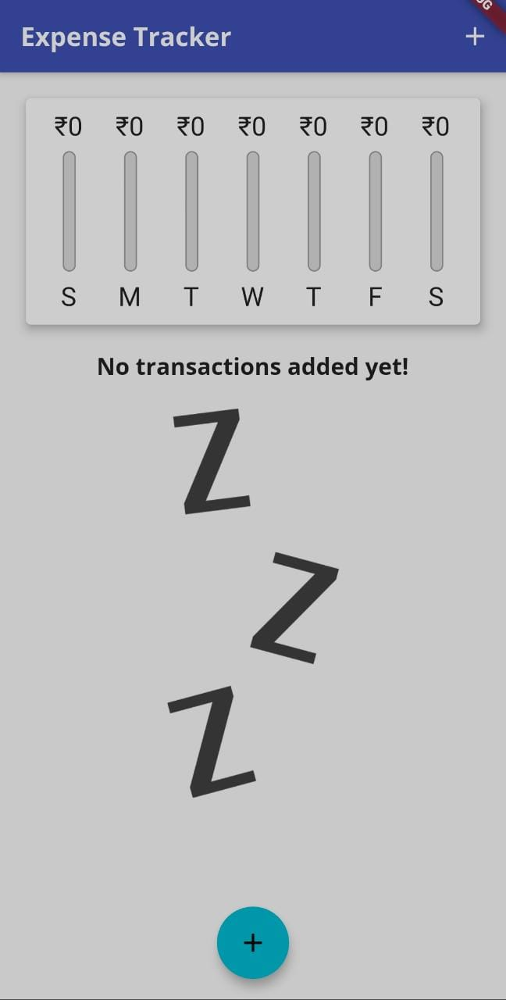
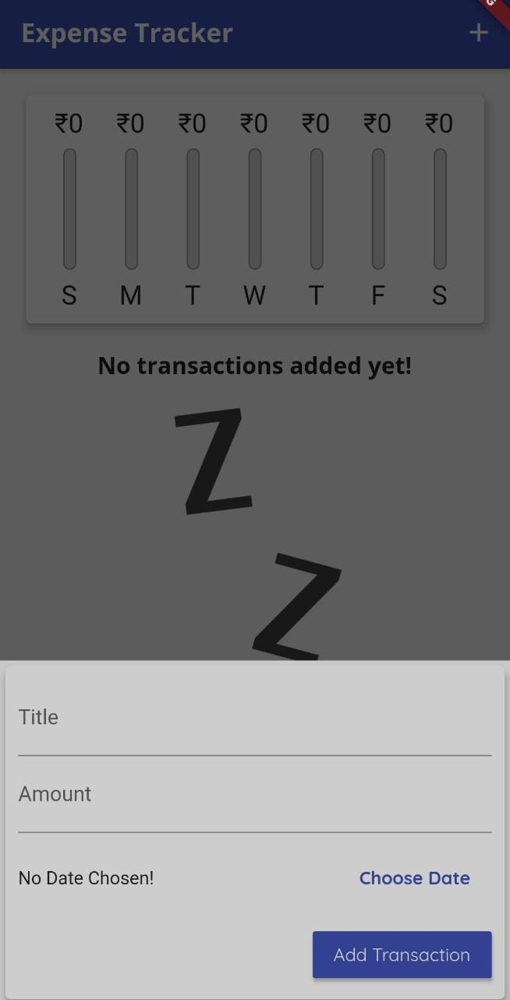
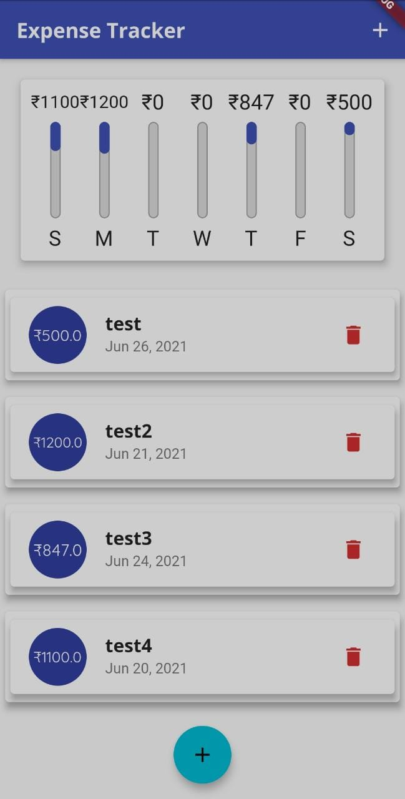

# Expense Tracker App
An app to keep track of its user's personal expenses

### Installation and Setup

* Download or clone this repo by using the link below:
```
git clone https://github.com/AditiAgarwal17/expense_tracker.git
```
* In the same directory run the following commands(considering you have flutter installed and an android device connected)
```
flutter packages get
flutter run
```

### Preview


|  |  |  |
|:--------------------------|:--------------------------|:--------------------------|
